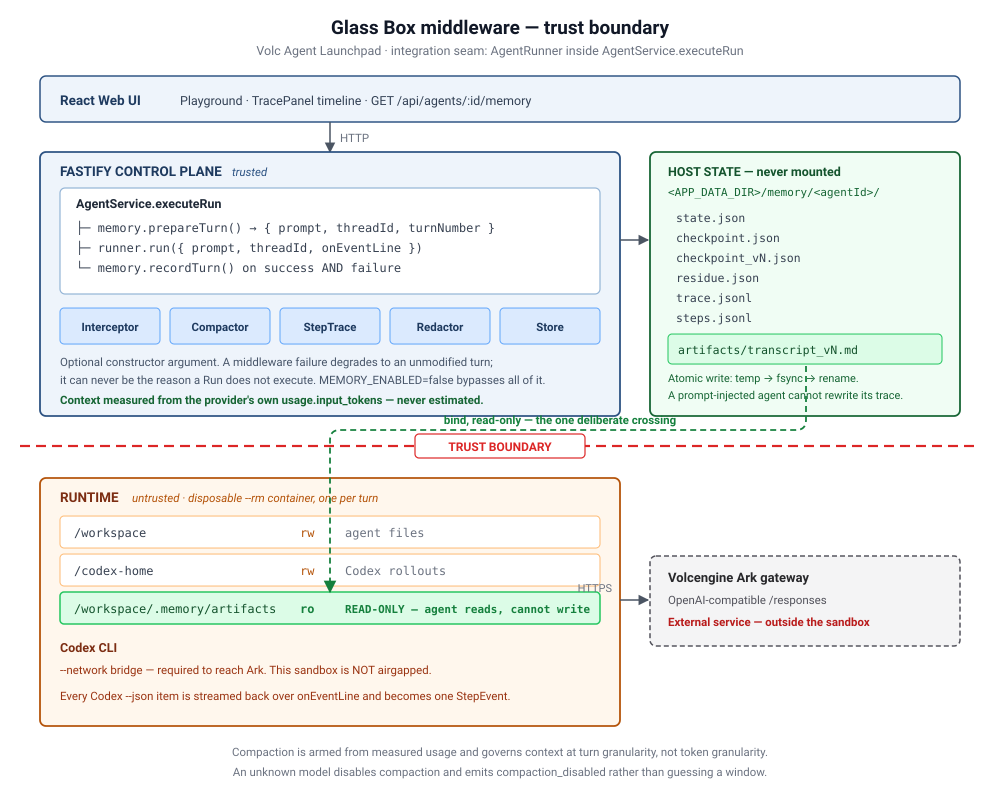
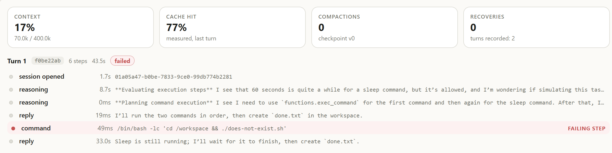
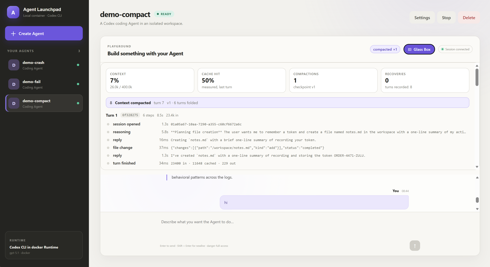
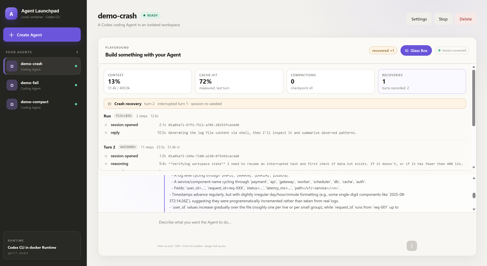
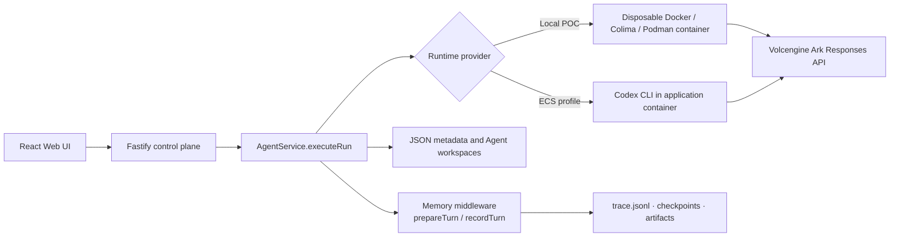

# Volc Agent Launchpad — Glass Box middleware

**Selected hackathon track: Glass Box (trace, audit, reliability).**

This repository is the Volc Agent Launchpad starter kit plus one middleware
tier, added at the `AgentRunner` seam inside `AgentService.executeRun`. The
starter kit gives you Agent CRUD, a browser Playground, persistent workspaces,
and Codex CLI backed by the Volcengine Ark Responses API. The middleware makes a
Run *diagnosable*: every step is recorded, context is governed against measured
token usage, interrupted turns are accounted for, and secrets are redacted
before anything reaches disk.

Run it locally with Docker, Colima, or rootless Podman, or deploy it to
Volcengine ECS.

> [!WARNING]
> This is a single-user proof of concept. It has no identity or authorization
> middleware (that is the Bouncer track) and ordinary containers are not
> hardened multi-tenant isolation. Do not use production data or credentials.
> See [SECURITY.md](SECURITY.md).

## Project name and throughline

**Glass Box** — because the failure mode this fixes is opacity.

> I hit my API token limit mid-task once. The context got wiped — objective,
> decisions, half-finished work, gone — and I started from square one. That is a
> bad afternoon, but it is also a bad architecture.
>
> **The throughline:** make the agent's memory the platform's job, and make
> every step of it visible. Context is governed automatically before the wall
> instead of manually after it, and when a Run does die it leaves a body — a
> correlated timeline that names the step that broke.

Every part of this submission traces back to that one sentence. The step trace
is the *visible*. Compaction and crash recovery are the *automatic*. The
read-only artifact mount is what keeps the record trustworthy once the agent
itself is in the loop.

---



Jump to: [what it adds](#what-the-middleware-adds) ·
[fail-closed context limit](#fail-closed-context-limit--read-this-before-configuring) ·
[turn lifecycle](#turn-lifecycle) · [trust boundary](#trust-boundary) ·
[durability](#durability-contract) · [verification](#verification) ·
[**limitations**](#limitations--what-this-does-not-claim)

---

## What the middleware adds

The baseline already solves durable state, durable workspaces, and session
decoupling. It does not solve these four, and this is what was built:

| Gap in the baseline | Added by the middleware |
| --- | --- |
| `parseCodexEventLine` keeps only `agent_message` and discards every command, file change, and tool call | `StepTraceCollector` emits one `StepEvent` per Codex item, keyed by `runId`, with `seq`, `status`, `durationMs`, and a redacted preview |
| A failed Run reports one error string with no indication of which step failed | `StepTraceSummary.failingStepIndex` names the failing step |
| `usage` is recorded but never acted on; Codex compacts invisibly on its own schedule | Server-side context governance against the provider's measured `usage.input_tokens`, with a deterministic extractive checkpoint |
| An interrupted Run is silently marked `cancelled`; nothing warns the next turn about half-applied side effects | Pending-turn watermark, `crash_recovery_triggered`, and a notice that requires verification instead of replaying the prompt |
| No redaction anywhere in the persisted record | Two-tier redaction applied to every disk write and every injected preamble |

### Correlation fields

Every `StepEvent` carries stable identifiers so a Run can be reassembled from
the raw JSONL without guessing:

| Requested field | This implementation |
| --- | --- |
| Agent ID | `StepEvent.agentId` — stable for the life of the Agent |
| Run ID / Trace ID | `StepEvent.runId` — one Run is one trace; steps are grouped by it in the UI and in `steps.jsonl` |
| Span ID | `StepEvent.seq` (monotonic ordering within the Run) plus `itemId` (the Codex item's own identity, `null` for lifecycle rows) |

`StepEvent.at` timestamps each row and `durationMs` is wall-clock since the
previous step in the same Run, so a timeline can be rendered from the events
alone.

The middleware is mounted as an **optional** constructor argument. With
`MEMORY_ENABLED=false` the platform runs exactly as shipped, the artifact mount
is dropped, and the event sink is `undefined`. Both hooks are wrapped in
`try`/`catch` at the call site: a middleware failure degrades to an unmodified
turn and can never be the reason a Run does not execute.

### Screenshots

Both captures below are live Runs against `gpt-5.1` in a local Docker Runtime,
not mockups.

**Failure diagnosis — the `demo-fail` Agent**



Turn 1 carries a **`failed`** badge, and the timeline names the culprit: the
`command` step running `./does-not-exist.sh`, flagged **`FAILING STEP`**. One
Run satisfies both halves of the Glass Box requirement — the task failed, *and*
the failing step is identified. The reply underneath shows what the baseline
would have hidden: the agent was still waiting on a `sleep` when the runtime
timeout killed the Run. Without step-level trace this is one error string.

**Compaction — the `demo-compact` Agent**



Context reads **7% — 26.0k / 400.0k** after
`Context compacted · turn 7 · v1 · 6 turns folded`. Turn 1 is still legible in
the timeline, and its final `reply` step records the objective's token,
`ORDER-4471-ZULU` — the string the agent still answers correctly after the
thread was re-seeded. Compaction happened at 296k; this is the other side of it.

**Crash recovery — the `demo-crash` Agent**



`Crash recovery · turn 2 · interrupted turn 1 · session re-seeded`. The
interrupted Run `f13cc83b` stops dead after 2 steps. Turn 2's reasoning then
opens with *"Verifying workspace state — I need to resume an interrupted task
and first check if data.txt exists"* — the agent establishes real state instead
of replaying the interrupted instruction, which is exactly what the recovery
notice asks it to do.

Baseline platform, for reference:

| Agent Playground | Create an Agent |
| --- | --- |
|  |  |

---

## Fail-closed context limit — read this before configuring

**If the middleware cannot determine the context window for your model, it does
not guess. It disables compaction entirely and reports why.**

`ARK_MODEL` is frequently an opaque endpoint id such as `ep-20241…`, which
carries no information about the model's real context window. Defaulting an
unknown id to a large number is precisely how you produce the context-overflow
error the middleware exists to prevent — a model with a 32k window silently
assumed to have 128k will overflow before the trigger ever fires. Guessing is
worse than not acting.

`apps/server/src/memory/context-limit.ts` resolves the limit in this order:

| Source | Behaviour |
| --- | --- |
| `MEMORY_CONTEXT_LIMIT` is set to a positive integer | Authoritative. Used. |
| Exact match in `KNOWN_CONTEXT_LIMITS` (`gpt-5`, `gpt-5.1`, `gpt-5-codex`) | Used. |
| Neither | `limit: null`, `source: "unknown"` → **compaction is off** |

When the limit is `null`:

- `compactionTrigger` is `null`, so the trigger comparison never runs and no
  checkpoint is ever minted. Turns execute normally and the step trace, crash
  recovery, and redaction tiers all keep working — only compaction is disabled.
- On the first recorded turn the interceptor appends a `compaction_disabled`
  event to `trace.jsonl`:

  ```jsonc
  {
    "type": "compaction_disabled",
    "reason": "context limit unknown for the configured model; set MEMORY_CONTEXT_LIMIT to enable compaction"
  }
  ```

- `GET /api/agents/:id/memory` reports `"compactionEnabled": false` and
  `"contextLimit": null` in `stats`.

This is a reported condition, not a thrown exception: the Run still succeeds.
The signal is in the trace and in the telemetry endpoint, which is where an
operator should be looking. Covered by the test
`never enables compaction when the context limit is unknown`.

### The second fail-closed case: a trigger below the runtime floor

Codex sends its own system prompt on every turn. Measured against `gpt-5.1`
that floor is **~11.8k tokens**, and a re-seed cannot go below it. If the
trigger sits at or under that floor, every re-seed lands straight back over the
line and the agent would compact on every single turn.

`MemoryState.floorInputTokens` records the usage measured on the turn
immediately after a re-seed. When the floor meets or exceeds the trigger,
compaction is disarmed, latched, and reported once as `compaction_ineffective`:

```
compaction_ineffective  floor=12006  trigger=11200
  "the runtime's own prompt overhead already exceeds the compaction trigger,
   so compaction cannot reduce context; raise MEMORY_CONTEXT_LIMIT above the
   floor or compaction stays off"
```

**Practical consequence.** `MEMORY_CONTEXT_LIMIT × MEMORY_TRIGGER_PCT` must
clear the runtime floor by a useful margin. With a ~12k floor and the default
`0.7`, anything below ~17000 disarms itself and anything below ~24000 leaves
little working room.

---

## Requirements

- Node.js 22+
- npm 10+
- Docker, Colima, or Podman
- A Volcengine Ark API key and endpoint that supports the Responses API

Codex CLI is included in the Runtime image and is not required on the host.

## Quick start

```bash
git clone <repository-url> volc-agent-launchpad
cd volc-agent-launchpad
cp .env.example .env          # then set ARK_API_KEY and ARK_MODEL
npm run poc
```

Open <http://localhost:3000>, create an Agent, and give it a task such as
`Create a TypeScript hello-world CLI, add a test, and run it.` The step
timeline appears in the trace panel as the Run proceeds.

`.env.example` ships `MEMORY_CONTEXT_LIMIT=30000`, which is a **demo value, not
any model's real window**. It is small enough that compaction fires after about
two turns so the behaviour is visible in a short demo, and large enough to clear
the runtime floor. For real use, set your model's actual context window.

### Reviewer path in one command

```bash
npm run check     # typecheck + 75 tests + build
```

---

## Local browser SOP

### 1. Check the local tools

```bash
node --version
npm --version
docker --version        # Docker Desktop, Docker Engine, or Colima
podman --version        # Use this instead when running Podman
```

Only one container engine is required.

### 2. Start the POC

```bash
ARK_API_KEY=your-ark-api-key \
ARK_MODEL=ep-your-endpoint-id \
npm run poc
```

The first run installs dependencies and builds the Runtime image. The script
selects Docker, Colima, or Podman automatically and overrides
`RUNTIME_PROVIDER=container`.

### 3. Stop and resume

Press `Ctrl+C`. Temporary Runtime containers are removed; Agent workspaces,
conversations, and middleware state are kept.

- macOS state: `~/.volc-agent-launchpad/`
- Linux state: `.local/`
- Custom location: set `LOCAL_POC_DATA_ROOT`

### Select a specific container engine

```bash
CONTAINER_ENGINE=podman \
ARK_API_KEY=your-ark-api-key \
ARK_MODEL=ep-your-endpoint-id \
npm run poc
```

Colima uses `CONTAINER_ENGINE=docker` because it exposes the Docker CLI. For a
clean Linux host, follow the
[rootless Podman setup](docs/LOCAL_POC.md#rootless-podman-on-linux).

---

## Trust boundary

```text
CONTROL PLANE (trusted)          <APP_DATA_DIR>/memory/<agentId>/
  AgentService.executeRun          state.json  checkpoint.json
    prepareTurn()  ── before       checkpoint_vN.json  residue.json
    recordTurn()   ── after,       trace.jsonl
                      on success   └── never bind-mounted
                      AND failure

── TRUST BOUNDARY ──────────────────────────────────────────────

RUNTIME (untrusted, disposable --rm container)
  /workspace                    rw   agent files
  /codex-home                   rw   Codex rollouts
  /workspace/.memory/artifacts  ro   transcripts  ← READ-ONLY
  Codex CLI ──HTTPS──▶ Ark gateway (external, outside the sandbox)
```

Durable middleware state lives under `APP_DATA_DIR` (default `.data/`), a
different tree from `AGENT_WORKSPACE_ROOT` (default `workspaces/`) that is never
mounted. A prompt-injected agent cannot rewrite its own checkpoint or trace.

The one deliberate crossing is `artifacts/`, mounted **read-only** so the agent
can `cat` a transcript for exact recall after a compaction but cannot alter it.
The mount is omitted when the middleware is disabled or when the agent id is not
safe as a path segment; both cases are tested.

The sandbox runs `--network bridge` and must, in order to reach Ark. Ark is an
external service *across* the boundary, not inside it.

---

## Turn lifecycle

```text
sendMessage ──▶ executeRun
                   │
                   ├─ memory.prepareTurn({ agentId, runId, prompt, threadId })
                   │    ├─ pending turn on record?  ──▶ crash_recovery_triggered
                   │    ├─ compaction pending?      ──▶ compaction_epoch
                   │    └─ returns { prompt, threadId, turnNumber }
                   │
                   ├─ runner.run({ prompt: plan.prompt, threadId: plan.threadId })
                   │
                   └─ memory.recordTurn({ ..., usage, durationMs, status })
                        ├─ append residue delta
                        ├─ clear pending marker              ← makes crash detectable
                        └─ usage.inputTokens >= trigger? ──▶ arm compaction for next turn
```

Both hooks are wrapped in `try`/`catch` at the call site, so a middleware
failure degrades to an unmodified turn and can never be the reason a Run does
not execute. There is a test for exactly that.

### Compaction is deterministic and extractive

No model call. An abstractive summariser would add a second inference
dependency on the recovery path — the path that must work when things are
already going wrong — and would make the output untestable. Everything the
checkpoint carries is copied verbatim, so the failure mode is "too terse",
never "confidently wrong".

The checkpoint holds the `objective` (the first user prompt, verbatim, carried
across every epoch), one extracted line of `progress[]` per turn, the last N
`carriedTurns[]` in full, a `transcriptArtifact` pointer, and the
`compactedThroughTurn` watermark. On a compaction turn the assembled prompt is
`preamble + "\n\n---\n\n" + userPrompt` — **the user's message is always
last**, asserted by test.

Compaction cannot loop: the trigger reads *post-turn measured* usage, which
collapses after a re-seed, so the flag is not re-armed. Structural, not
bookkeeping.

### Crash recovery

`prepareTurn` writes `state.pendingTurn` before the run; `recordTurn` clears it
on **both** the success and failure paths. A `pendingTurn` still present at the
next `prepareTurn` means the process died mid-turn — without recording on the
failure path, a cancelled Run would be indistinguishable from a crash.

Two behaviours worth naming:

- **The Codex thread is preserved on a plain crash.** Codex's own rollout on
  disk is a better record than any summary this middleware could build.
  Re-seeding is reserved for a thread that is genuinely no longer trustworthy.
- **The interrupted prompt is never re-issued as an instruction.** Replaying is
  the one action that can duplicate a non-idempotent side effect. Recovery
  injects a notice that describes state and requires verification:

  > Turn 7 was terminated before it reported a result, so its side effects may
  > be fully applied, partially applied, or absent. Establish the real state
  > from the workspace before acting; do not assume it failed and do not
  > blindly repeat it.

---

## Durability contract

```
<APP_DATA_DIR>/memory/<agentId>/
├── state.json           watermarks, pending turn, counters
├── checkpoint.json      latest
├── checkpoint_vN.json   immutable per-epoch copy
├── residue.json         bounded by turn count AND serialised bytes
├── trace.jsonl          append-only
├── steps.jsonl          append-only step timeline
└── artifacts/           ← the only path mounted into the Runtime (read-only)
    └── transcript_vN.md
```

`writeAtomic` performs temp file → `fsync` → `rename` → best-effort directory
`fsync`. Against the threat model actually claimed — `SIGKILL` of the Node
process, container OOM — the rename alone suffices, because the page cache
survives; the `fsync` calls additionally cover host power loss on filesystems
that honour them. The directory `fsync` is wrapped in a `catch` because it is
not portable. A reader never observes a partial file.

**Corruption is survivable.** Every read wraps `JSON.parse`. On failure the file
is renamed to `<name>.corrupt.<timestamp>`, a `state_quarantined` event is
appended, and a default is returned. A crash-recovery mechanism that cannot
survive a torn file is not one.

**The trace is append-only.** `trace.jsonl` and `steps.jsonl` use async
`appendFile`; cost is O(1) per turn rather than rewriting the whole file.

---

## Telemetry

```bash
curl -H "Authorization: Bearer $APP_AUTH_TOKEN" \
  http://localhost:3000/api/agents/<agentId>/memory | jq
```

```jsonc
{
  "enabled": true,
  "stats": {
    "turnsRecorded": 12, "lastInputTokens": 74210,
    "contextLimit": 100000, "contextUsagePct": 74,
    "compactionTrigger": 70000, "compactionPending": true,
    "compactionCount": 1, "recoveryCount": 1,
    "checkpointVersion": 1, "residueCount": 3,
    "compactionEnabled": true
  },
  "events": [ /* trace.jsonl, most recent 200 */ ],
  "steps":  [ /* per-Run step timeline */ ]
}
```

Every number here is measured. `cacheHitPct` is computed from
`usage.cached_input_tokens / usage.input_tokens` and is `null` when the provider
does not report it. **No performance or cost-reduction figure is asserted** —
compaction plus a thread re-seed is by construction a full prefix-cache
invalidation on the compaction turn.

---

## Verification

```bash
npm run check
```

```
typecheck  → clean (server + web)
vitest run → 8 files, 75 tests, 75 passed
build      → clean (web + server)
```

| Count | Scope |
| ---: | :--- |
| 12 | pre-existing platform tests, unmodified |
| 50 | memory unit (`memory/memory.test.ts`) |
| 8 | end-to-end through the real `AgentService` seam (`memory/integration.test.ts`) |
| 3 | artifact mount argv (`container-codex-runner.test.ts`) |
| 2 | against a really-spawned runner (`memory/runner-sink.test.ts`) |

Targeted runs while iterating:

```bash
cd apps/server
npx vitest run src/memory                          # middleware only
npx vitest run -t "identifies the failing step"    # one behaviour
npx vitest src/memory                              # watch mode
```

Representative behaviours pinned by tests:

- `never enables compaction when the context limit is unknown`
- `carries the objective verbatim rather than paraphrasing it`
- `keeps the user's message on the compaction turn`
- `flushes residue and does not compact again on the next turn`
- `detects a turn that was prepared but never recorded`
- `describes the interrupted work without re-issuing it as an instruction`
- `quarantines a corrupt state file instead of wedging the agent`
- `rejects an agent id that would escape the memory root`
- `mounts the Agent's artifacts read-only so pointers resolve`
- `identifies the failing step of a failed Run`
- `keeps secrets out of the persisted step timeline`
- `does not fail a Run when the middleware throws`

Other checks:

```bash
terraform fmt -check -recursive deploy/volcengine
docker compose config
```

> [!NOTE]
> On a WSL2 `/mnt/c` checkout, module resolution and Fastify boot alone can take
> ~10s, which exceeds vitest's 5s default. `apps/server/vitest.config.ts` sets
> `testTimeout` and `hookTimeout` to 60s for this reason. No assertion was
> weakened.

---

## Limitations — what this does NOT claim

Read this before believing anything above.

1. **Live-verified, but narrowly.** Real turns against `gpt-5.1` through the
   OpenAI-compatible `/responses` path confirmed real `usage.input_tokens`
   driving the trigger, real `cached_input_tokens`, a real Codex step timeline,
   a real compaction epoch, and correct recall of a turn-1 value **through** a
   thread re-seed. Not covered: multi-hour sessions, tool-heavy runs, and
   compaction quality on a genuinely long task.
2. **Turn granularity, not token granularity.** The middleware cannot stop a
   single turn from overflowing the window. It detects that a conversation has
   grown too large and resets it before the next turn. A single enormous tool
   output inside one turn is Codex's problem, not this middleware's.
3. **One-turn measurement lag.** The compaction decision uses the previous
   turn's usage. `MEMORY_TRIGGER_PCT` at 0.70 exists to absorb this; a workload
   whose turns routinely add >30% of the window can still overflow.
4. **Extractive, therefore lossy in a specific way.** The checkpoint preserves
   the objective and per-turn headlines exactly, and drops reasoning and
   intermediate tool detail. That detail is recoverable from the transcript
   artifact only if the agent chooses to read it. Nothing forces it to.
5. **Not O(1).** Active context is bounded by the trigger, not constant.
   `progress[]` grows until it hits its cap, then elides oldest-first —
   information decays monotonically across epochs.
6. **Codex still compacts independently.** This middleware does not disable
   Codex's own context management; both are active, and Codex's is invisible to
   the trace.
7. **No cache-hit improvement is claimed.** Compaction plus a thread re-seed
   invalidates the prefix by construction. The trace measures the real rate;
   whether the net effect is positive depends on workload and is not asserted.
8. **Single-node only.** The per-agent lock is in-process. Two server processes
   over one `APP_DATA_DIR` would race.
9. **An externally terminated Run identifies no failing step.**
   `failingStepIndex` is derived from steps that reported an error. When a Run
   is killed from outside — `CODEX_TIMEOUT_MS`, cancellation — the step in
   flight never emits `item.completed`, so every recorded step reads `ok` and
   the index is `null`. The Run is still marked failed and its partial timeline
   is still persisted; the trace says *that* it died and where it got to, not
   which step killed it. Observed against a real timeout, not hypothesised.
10. **Memory is not reclaimed when an Agent is deleted.** `deleteAgent`
    archives the workspace and removes the Agent, its messages, and its Runs
    from the store; `<APP_DATA_DIR>/memory/<agentId>/` is left in place.
    Retention bounds artifacts and residue *within* a live agent, but nothing
    reclaims an orphaned tree. Defensible for an audit record that should
    outlive its subject, but it is unbounded growth and it is not currently a
    policy — it is an omission.
11. **Redaction is best-effort and two-tiered.** `redact()` is high precision —
    configured literals plus unambiguous provider-key shapes (`sk-…`, `ghp_…`,
    `AKIA…`, PEM blocks) — and is applied to everything persisted, including
    user prose. `redactMachine()` adds `key: value` heuristics and is confined
    to machine-generated content (shell commands, tool previews).

The redaction split exists because the single-tier version failed a live test:
the heuristic matched `token:` and turned the objective
`"Remember this token: ORDER-4471-ZULU"` into `"[REDACTED]"` — destroying the
one string the checkpoint promises to keep verbatim. Redaction now also happens
when the residue delta is constructed, not at the serialisation boundary, so
the preamble injected into a live prompt and the checkpoint rehydrated from
disk after a restart are byte-identical. It is not a general DLP layer.

---

## Configuration

| Variable | Default | Purpose |
| --- | --- | --- |
| `ARK_API_KEY` | Required | Ark model API key. |
| `ARK_MODEL` | Required | Responses-capable endpoint or model ID. |
| `ARK_BASE_URL` | Beijing v3 endpoint | Ark OpenAI-compatible API URL. |
| `APP_AUTH_TOKEN` | Empty on loopback | Shared demo token; use 24+ random characters remotely. |
| `RUNTIME_PROVIDER` | `local-process` | `container` for disposable local Runtime containers. |
| `CODEX_SANDBOX_MODE` | `workspace-write` | Codex inner sandbox mode. |
| `CODEX_TIMEOUT_MS` | `600000` | Maximum duration of one turn. |
| `LOCAL_POC_DATA_ROOT` | Platform-specific | Local metadata, workspace, and session directory. |
| `MEMORY_ENABLED` | `true` | Master switch. `false` restores stock platform behaviour and drops the artifact mount. |
| `MEMORY_CONTEXT_LIMIT` | unset | Authoritative context window in tokens. When unset the limit is resolved from `KNOWN_CONTEXT_LIMITS`; **compaction is disabled only when the model is unknown as well** — see [above](#fail-closed-context-limit--read-this-before-configuring). |
| `MEMORY_TRIGGER_PCT` | `0.7` | Fraction of the window that arms compaction on the next turn. |
| `MEMORY_ARTIFACT_MOUNT` | `/workspace/.memory/artifacts` | Read-only in-container mount point for transcripts. |

`MEMORY_TRIGGER_PCT` is 0.7 rather than a tighter value because the decision is
made from the **previous** turn's measured usage. Between that measurement and
the next prefill, context can still grow by one full turn, so the gap between
the trigger and 1.0 has to cover one turn plus generation headroom.

The **Default** column is the value the server uses when the variable is absent
from the environment, which is not always what [`.env.example`](.env.example)
ships. In particular `.env.example` sets `MEMORY_CONTEXT_LIMIT=30000` — a small
**demo** value chosen so compaction fires within a couple of turns, not any
model's real window.

See [.env.example](.env.example) for all Runtime and resource-limit options.

---

## How it works



The binding constraint: **this platform does not own the conversation.** History
lives in Codex CLI's rollout under `CODEX_HOME`, replayed by
`codex exec resume <threadId>`. The seam carries a prompt string and a thread
id, not a message array, so the middleware uses the only two levers that exist —
prepend text to the next prompt, and decide whether that prompt starts a fresh
thread — and measures context from the provider's own reported usage.

Consequence, stated plainly: the middleware governs context at **turn**
granularity, not token granularity. It cannot prevent a single turn from
overflowing. It detects that a conversation has grown past a threshold and
resets it cleanly before the next turn.

Compaction is deterministic and extractive — no second model call on the
recovery path, the path that must work when things are already going wrong.
The objective is carried verbatim, per-turn progress is extracted, recent turns
are kept in full, and the complete pre-compaction transcript is written to the
read-only artifact mount for exact recall. The failure mode is "too terse",
never "confidently wrong".

See [docs/ARCHITECTURE.md](docs/ARCHITECTURE.md) for baseline component and
extension boundaries.

## Deployment

- [Existing Linux ECS with Docker](docs/DEPLOYMENT.md#existing-linux-ecs)
- [Complete Volcengine environment with Terraform](docs/DEPLOYMENT.md#terraform-deployment)
- [Local Docker, Colima, and Podman details](docs/LOCAL_POC.md)

```bash
cp .env.example .env.production
./scripts/deploy-existing-ecs.sh .env.production
```

The Terraform path provisions VPC, subnet, security group, ECS, and EIP:

```bash
cp deploy/volcengine/terraform.tfvars.example \
  deploy/volcengine/terraform.tfvars
./scripts/deploy-volcengine.sh
```

## Development

```bash
npm install
cp .env.example .env
npm install --global @openai/codex@0.111.0
npm run dev
```

- Web UI: <http://localhost:5173>
- API: <http://localhost:3000>

Use local paths in `.env` when running outside Docker:

```dotenv
APP_DATA_DIR=.data
AGENT_WORKSPACE_ROOT=workspaces
CODEX_HOME=codex-home
```

## Documentation

- [Architecture diagram (one page)](docs/diagrams/architecture.svg)
- [Architecture](docs/ARCHITECTURE.md)
- [Local POC](docs/LOCAL_POC.md)
- [Deployment](docs/DEPLOYMENT.md)
- [Hackathon extension guide](docs/HACKATHON_EXTENSION_GUIDE.md)
- [Security policy](SECURITY.md)
- [Contributing](CONTRIBUTING.md)

## License

[MIT](LICENSE)
